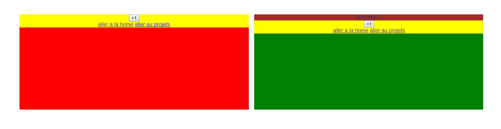
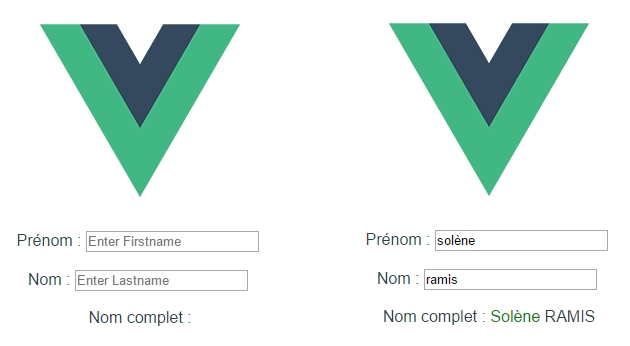

# Vue.js - Solène Ramis

### Tests Unitaires :
```
Tests unitaires en Mocha
```
<hr>

### MyProject :
```
Test components - containers + test vuex avec actions et getter + store
```


<hr>

### ProjetVue :
```
Test de l'architecture vue + exemples de base + watcher - computed
```

